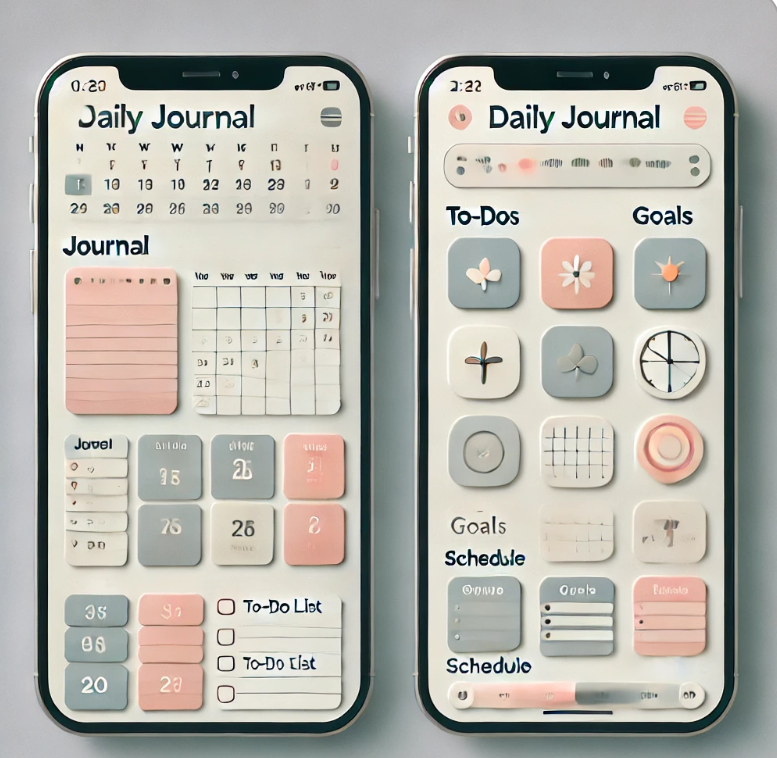
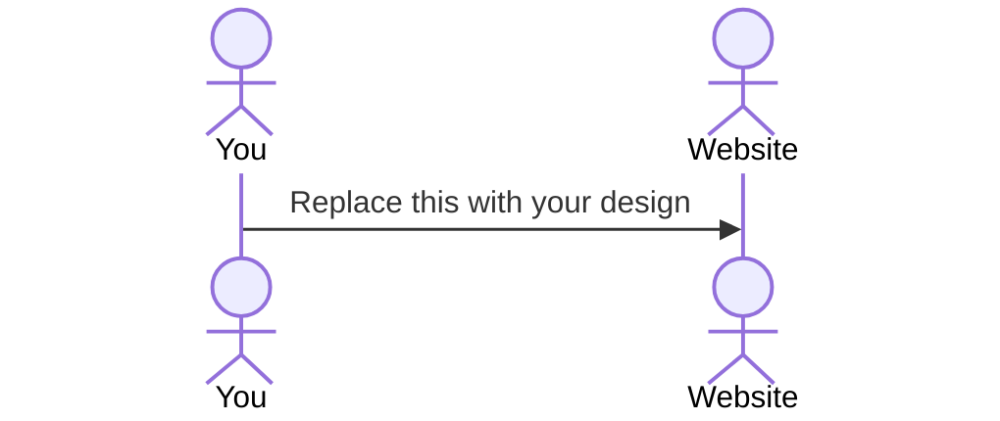

# Daily Planner

[My Notes](notes.md)

I want to make a jurnal application that I can reffer yearly goal, monthly, goal, weekly goaln and daily goal. It will be also nice to be able to make a schedule for a day. I want to make it especially for mobile schreen.

> [!NOTE]
>  This is a template for your startup application. You must modify this `README.md` file for each phase of your development. You only need to fill in the section for each deliverable when that deliverable is submitted in Canvas. Without completing the section for a deliverable, the TA will not know what to look for when grading your submission. Feel free to add additional information to each deliverable description, but make sure you at least have the list of rubric items and a description of what you did for each item.

> [!NOTE]
>  If you are not familiar with Markdown then you should review the [documentation](https://docs.github.com/en/get-started/writing-on-github/getting-started-with-writing-and-formatting-on-github/basic-writing-and-formatting-syntax) before continuing.

## 🚀 Specification Deliverable

> [!NOTE]
>  Fill in this sections as the submission artifact for this deliverable. You can refer to this [example](https://github.com/webprogramming260/startup-example/blob/main/README.md) for inspiration.

For this deliverable I did the following. I checked the box `[x]` and added a description for things I completed.

- [/] Proper use of Markdown
- [/] A concise and compelling elevator pitch
- [/] Description of key features
- [/] Description of how you will use each technology
- [/] One or more rough sketches of your application. Images must be embedded in this file using Markdown image references.

### Elevator pitch

Have you ever wished if you had a daily planner like what you used on your mission? Planner that allows you to reffer you goal and daily schedule? Here is what I made for you! Throught this daily planner, you can: Schedule you daily task, reffer your yealy, monthly, weekly, daily goal, and write your jurnal. It will be your life hack to achieve what you hope to achieve in your life!

### Design

Lorem ipsum dolor sit amet, consectetur adipiscing elit, sed do eiusmod tempor incididunt ut labore et dolore magna aliqua. Ut enim ad minim veniam, quis nostrud exercitation ullamco laboris nisi ut aliquip ex ea commodo consequat. Duis aute irure dolor in reprehenderit in voluptate velit esse cillum dolore eu fugiat nulla pariatur. Excepteur sint occaecat cupidatat non proident, sunt in culpa qui officia deserunt mollit anim id est laborum.

### Key features

- Register goals
- Input schdules and tasks
- Write a jurnal

### Technologies

I am going to use the required technologies in the following ways.

- **HTML** - Structure every letters and words with desirable font.
- **CSS** - Design responsibly for mobile size screen.
- **React** - Making componets and adds webiste a functions for example, type schedule, task, and goals. And also fetching request to the server side to process user inputs.
- **Service** - process user input such as creating or updating schedules, tasks, and goals, and will provide the       necessary data to the React frontend through APIs. It also manages user authentication and interactions with the database.
- **DB/Login** - DB is for keep the datas that users input such as schedule, task, and goals. Login is to be able to provide singple user and keep thier data by giving each user an ID so that DB can tell wichi person to interact. 
- **WebSocket** -  will be used to enable real-time updates for schedules, tasks, and goals. For example, when a user updates their schedule, the changes will immediately reflect on all connected devices without needing to refresh the page.

## 🚀 AWS deliverable

For this deliverable I did the following. I checked the box `[x]` and added a description for things I completed.

- [x] **Server deployed and accessible with custom domain name** - [My server link](https://lifehackjournal.click).

## 🚀 HTML deliverable

For this deliverable I did the following. I checked the box `[x]` and added a description for things I completed.

- [x] **HTML pages** - I created structual function of my app by using HTML
- [x] **Proper HTML element usage** - I did use proper HTML element and it works.
- [x] **Links** - I put the GitHub link in index.html page.
- [x] **Text** - I put some text in every pages.
- [x] **3rd party API placeholder** - I use Google Calender AIP for journal page.
- [x] **Images** - I use image for the index.html page for design purpose.
- [x] **Login placeholder** - I put Login Placeholder in login.html
- [x] **DB data placeholder** - I put the DB palceholder in Journal and schedule page.
- [x] **WebSocket placeholder** - I put WebSocket Placeholer in index.html page
## 🚀 CSS deliverable

For this deliverable I did the following. I checked the box `[x]` and added a description for things I completed.

- [x] **Header, footer, and main content body** - Implemented and styled properly across all pages, ensuring consistency and structure.
- [x] **Navigation elements** - Navigation bar is styled and aligned correctly for usability.
- [x] **Responsive to window resizing** - Implemented flexible layouts and relative sizing to ensure proper responsiveness.
- [x] **Application elements** - Forms, buttons, checkboxes, and text areas are properly styled and functional.
- [x] **Application text content** - All text elements are clearly styled and readable.
- [x] **Application images** - I add style for image but jsut did not provide it yet.

## 🚀 React part 1: Routing deliverable

For this deliverable I did the following. I checked the box `[x]` and added a description for things I completed.

- [x] **Bundled using Vite** - I use Vite to build my startup app.
- [x] **Components** - I made a componet that has HTML and style, first I used CSS but decided to get rid of it since I prefer BootStrap more. 
- [x] **Router** - My Routing works well.

## 🚀 React part 2: Reactivity

For this deliverable I did the following. I checked the box `[x]` and added a description for things I completed.

- [x] **All functionality implemented or mocked out** - I have implemented most of the functionality required for this project. I used setInterval to mock WebSocket messages in the Home component. LocalStorage was used to persist data for goals, journal entries, tasks, and schedules. State updates and UI interactions were implemented using useState.
- [x] **Hooks** - I used useState to manage user input and dynamic updates in multiple components. I used useEffect to handle data persistence with LocalStorage and simulate WebSocket behavior. Cleanup functions were included in useEffect to prevent memory leaks when components unmount.

## 🚀 Service deliverable

For this deliverable I did the following. I checked the box `[x]` and added a description for things I completed.

- [x] **Node.js/Express HTTP service** - I set up an Express.js server to handle API requests for journal entries, goals, tasks, and schedules.
- [x] **Static middleware for frontend** - I configured Express to serve static files, allowing the frontend to interact with the backend.
- [x] **Calls to third party endpoints** - I did not use Google Calendar AIP because I did not want to pay or anything now. So Insted I used react calendar library. I hope it counts.
- [x] **Backend service endpoints** -  I implemented RESTful API endpoints for handling journal entries, task management, and scheduling features.
- [x] **Frontend calls service endpoints** - I connected the frontend to backend service endpoints, allowing users to save and retrieve journal entries, goals, and tasks dynamically.
## 🚀 DB/Login deliverable

For this deliverable I did the following. I checked the box `[x]` and added a description for things I completed.

- [x] **User registration** - I created a Register page that allows users to input a username and password, which are then stored in MongoDB through the /api/register endpoint.
- [x] **User login and logout** - I implemented login and logout functionality using sessions. When a user logs in, their session is stored on the server, and logout destroys the session.
- [x] **Stores data in MongoDB** - I connected the application to MongoDB Atlas and stored user data, journal entries, goals, tasks, and schedules in corresponding collections.
- [x] **Stores credentials in MongoDB** -  I stored user credentials (username and password) securely in the users collection in MongoDB.
- [x] **Restricts functionality based on authentication** - I checked the session on page load using /api/session to determine whether a user is logged in and restricted access accordingly.

## 🚀 WebSocket deliverable

For this deliverable I did the following. I checked the box `[x]` and added a description for things I completed.

- [x] **Backend listens for WebSocket connection** -  Implemented WebSocket server using the ws package in index.js, and confirmed connection with wss.on('connection', ...).
- [x] **Frontend makes WebSocket connection** - Used new WebSocket(...) in Home.jsx to connect to backend based on current protocol (ws or wss). Confirmed connection with browser dev tools.
- [x] **Data sent over WebSocket connection** - Sent message "Hello from client!" on connection; backend logs confirmed receipt and sent a response.
- [x] **WebSocket data displayed** - WebSocket response is displayed in the frontend with:
I heard you say: "Hello from client!" shown on the Home page.
- [x] **Application is fully functional** - Full functionality tested on both local and production (https://startup.lifehackjournal.click).
Nginx configured for WebSocket. Application shows real-time WebSocket communication.
